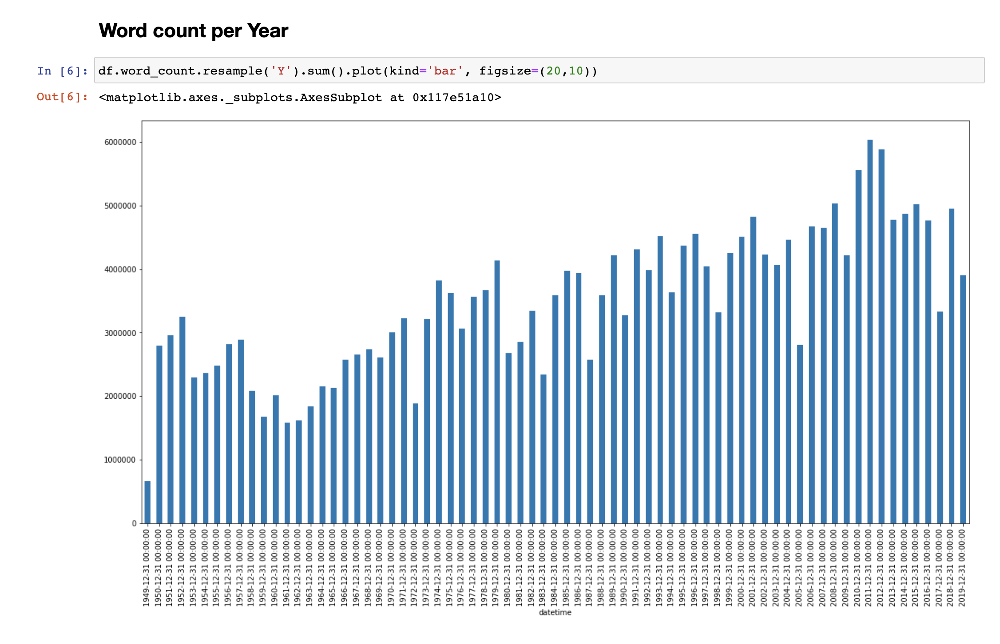
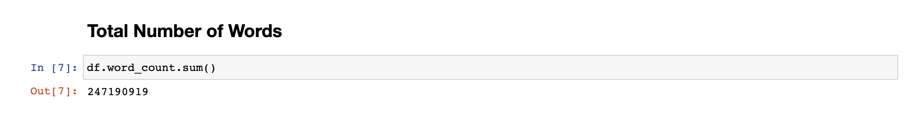
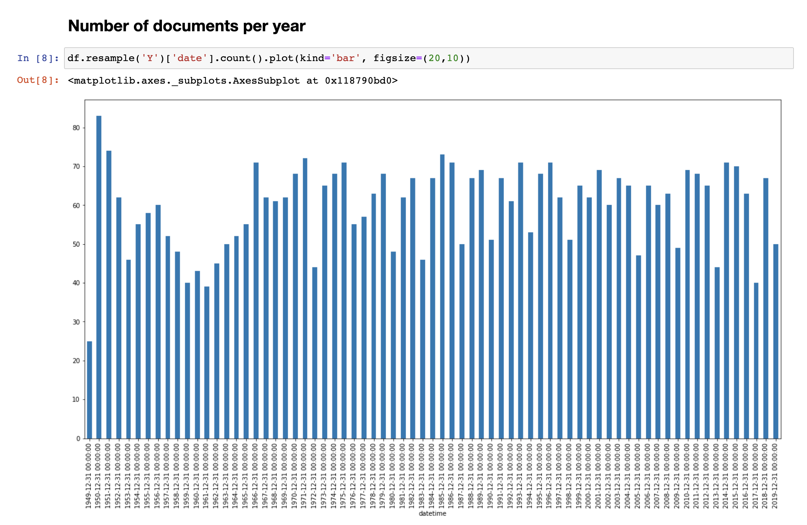

Code to download parliament proceedings from the German parliament and convert it from XML to CSV.
Processing of the data TBD.

Data source ist the [German Bundestag](https://www.bundestag.de/services/opendata).

Clone the repository:
```
> git clone https://github.com/marcellosch/german-parliament.git
```

Cd into the project:
```
> cd german-parliament
```

Run the donwload script:
```
> python3 src/script.py
```



